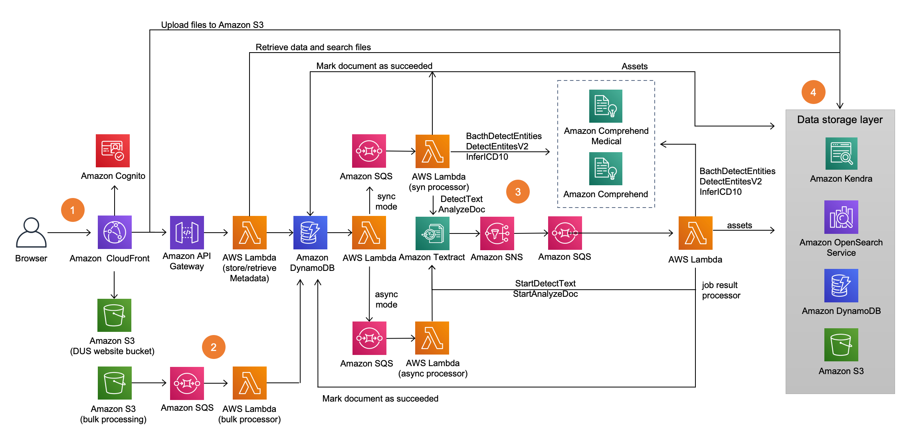

# Amazon Textract Workbench

Quote from [the official website](https://aws.amazon.com/textract):

> Amazon Textract is a machine learning (ML) service that automatically extracts text, handwriting, and data from scanned documents. It goes beyond simple optical character recognition (OCR) to identify, understand, and extract data from forms and tables. Today, many companies manually extract data from scanned documents such as PDFs, images, tables, and forms, or through simple OCR software that requires manual configuration (which often must be updated when the form changes). To overcome these manual and expensive processes, Textract uses ML to read and process any type of document, accurately extracting text, handwriting, tables, and other data with no manual effort. You can quickly automate document processing and act on the information extracted, whether you’re automating loans processing or extracting information from invoices and receipts. Textract can extract the data in minutes instead of hours or days. Additionally, you can add human reviews with Amazon Augmented AI to provide oversight of your models and check sensitive data.

This repo is aimed at giving you a place to experiment with the tooling and will show you a step by step tutorial on how to take advantage of the geometric context detected in an image to make the tagging of key and value pairs easier and more accurate with [Amazon Textract](https://aws.amazon.com/textract/). We are running this application on top of [SageMaker Studio Lab](https://studiolab.sagemaker.aws/) combining multiple libraries such as [Hugging Face](https://huggingface.co/), [SpaCy](https://spacy.io/), and [Textractor](https://github.com/aws-samples/amazon-textract-textractor). We will also make use of the recently launched ["Queries"](https://aws.amazon.com/blogs/machine-learning/specify-and-extract-information-from-documents-using-the-new-queries-feature-in-amazon-textract/) functionality in Textract. 

## Getting started
- [SageMaker StudioLab Explainer Video](https://www.youtube.com/watch?v=FUEIwAsrMP4)
- [How to access AWS resources from Studiolab](https://github.com/aws/studio-lab-examples/blob/main/connect-to-aws/Access_AWS_from_Studio_Lab.ipynb)
- [Amazon Textract Developer Guide](https://docs.aws.amazon.com/textract/latest/dg/API_Operations.html)
- [Amazon Textract Reponse Parser](https://github.com/aws-samples/amazon-textract-response-parser/tree/master/src-python)
- [Amazon Textractor Library](https://github.com/aws-samples/amazon-textract-textractor)
- [Intelligent Document Processing (IDP) Workshop by AWS](https://catalog.us-east-1.prod.workshops.aws/workshops/c2af04b2-54ab-4b3d-be73-c7dd39074b20/en-US/)
- [Streamlit - "A faster way to build and share data apps"](https://streamlit.io/)

## Requirements
- [SageMaker Studio Lab](https://studiolab.sagemaker.aws/) account. See this [explainer video](https://www.youtube.com/watch?v=FUEIwAsrMP4) to learn more about this.
- `Python==3.7`
- `Streamlit`
- `TensorFlow==2.5.0`
- `PyTorch>=1.10`
- `Hugging Face Transformers`
- Other libraries (see `environment.yml`)

## Step by step tutorial

### Clone repo, install dependencies, and launch your app

Follow the steps shown in `launch_app.ipynb` [](https://studiolab.sagemaker.aws/import/github/machinelearnear/amazon-textract-workbench/blob/main/launch_app.ipynb) Click on `Copy to project` in the top right corner. This will open the Studio Lab web interface and ask you whether you want to clone the entire repo or just the Notebook. Clone the entire repo and click `Yes` when asked about building the `Conda` environment automatically. You will now be running on top of a `Python` environment with `Streamlit` and `Gradio` already installed along with other libraries. 

Your Streamlit app will be running on `f'https://{studiolab_domain}.studio.{studiolab_region}.sagemaker.aws/studiolab/default/jupyter/proxy/6006/'`

### Pre-process image and compare modified vs original

This is example code to implement [SauvolaNet](https://github.com/Leedeng/SauvolaNet), an end-to-end document binarization solution:

```python
from os.path import exists as path_exists
path_repo_sauvolanet = 'dependencies/SauvolaNet'
if not path_exists(path_repo_sauvolanet):
    os.system(f'git clone https://github.com/Leedeng/SauvolaNet.git {path_repo_sauvolanet}')
sys.path.append(f'{path_repo_sauvolanet}/SauvolaDocBin/')
pd.set_option('display.float_format','{:.4f}'.format)
from dataUtils import collect_binarization_by_dataset, DataGenerator
from testUtils import prepare_inference, find_best_model
from layerUtils import *
from metrics import *

@st.experimental_singleton
def sauvolanet_load_model(model_root = f'{path_repo_sauvolanet}/pretrained_models/'):
    for this in os.listdir(model_root) :
        if this.endswith('.h5') :
            model_filepath = os.path.join(model_root, this)
            model = prepare_inference(model_filepath)
            print(model_filepath)
    return model

def sauvolanet_read_decode_image(model, im):
    rgb = np.array(im)
    gray = cv2.cvtColor(rgb, cv2.COLOR_RGB2GRAY)
    x = gray.astype('float32')[None, ..., None]/255.
    pred = model.predict(x)
    return Image.fromarray(pred[0,...,0] > 0)

...

with st.spinner():
    sauvolanet_model = sauvolanet_load_model()
    modified_image = sauvolanet_read_decode_image(sauvolanet_model,input_image)
    st.success('Done!')
```

Finally we use [`streamlit-image-comparison`](https://github.com/fcakyon/streamlit-image-comparison) to display both images (modified, original) next to each other.

```python
with st.expander("See modified image"):
    image_comparison(
        img1=input_image, img2=modified_image,
        label1='Original', label2='Modified',
    )
```

Here's a demo:
https://user-images.githubusercontent.com/78419164/166663497-79cdda76-93b3-43b8-b9c4-ed00f438cd25.mov

### Make API request to Textract with `Queries`

Recently, Amazon released a new functionality in Textract called "Queries". You can think of it as [VQA](https://paperswithcode.com/task/visual-question-answering) where you can ask questions to your scanned documents and based on image and language context you will get the most likely response. You can see the [official documentation here](https://boto3.amazonaws.com/v1/documentation/api/latest/reference/services/textract.html#Textract.Client.analyze_document) and a [sample Notebook here](https://github.com/aws-samples/amazon-textract-code-samples/blob/master/python/queries/paystub.ipynb). 

Here's some sample code:

```python
# Call Textract AnalyzeDocument by passing a document from local disk
response = textract.analyze_document(
    Document={'Bytes': imageBytes},
    FeatureTypes=["QUERIES"],
    QueriesConfig={
        "Queries": [{
            "Text": "What is the year to date gross pay",
            "Alias": "PAYSTUB_YTD_GROSS"
        },
        {
            "Text": "What is the current gross pay?",
            "Alias": "PAYSTUB_CURRENT_GROSS"
        }]
    })
```

And this is how it looks on the Streamlit application that you will deploy with this repo:

https://user-images.githubusercontent.com/78419164/166663542-8c8c82c6-41b5-4d07-9c71-3dfcd3573f2d.mov

### Use response with Amazon Comprehend, HuggingFace, SpaCy, etc.

Example code to parse the output from Amazon Textract and use it with [Hugging Face](https://huggingface.co/) models under the task `summarization`.

```python
def parse_response(response):
    from trp import Document
    doc = Document(response)
    text = ''
    for page in doc.pages:
        for line in page.lines:
            for word in line.words:
                text = text + word.text + ' '
    return text.strip()

@st.experimental_singleton
def load_model_pipeline(task, model_name):
    return pipeline(task, model=model_name)

...

with st.spinner('Downloading model weights and loading...'):
    pipe = load_model_pipeline(task="summarization", model_name=options)
    summary = pipe(
        parse_response(st.session_state.response), 
        max_length=130, min_length=30, do_sample=False)

with st.expander('View response'):
    st.write(summary)
```

## Next steps: How to do large scale document processing with Amazon Textract
- [Using SNS and SQS to handle concurrency at large scale](https://github.com/aws-samples/amazon-textract-serverless-large-scale-document-processing)
- [Using CDK and Step Functions](https://github.com/aws-samples/amazon-textract-transformer-pipeline)
- [Reference architecture: "Document Understanding Solution"](https://aws.amazon.com/solutions/implementations/document-understanding-solution/)

> The Document Understanding Solution (DUS) delivers an easy-to-use web application that ingests and analyzes files, extracts text from documents, identifies structural data (tables, key value pairs), extracts critical information (entities), and creates smart search indexes from the data. Additionally, files can be uploaded directly to and analyzed files can be accessed from an Amazon Simple Storage Service (Amazon S3) bucket in your AWS account.

> This solution uses AWS artificial intelligence (AI) services that address business problems that apply to various industry verticals:
> - Search and discovery: Search for information across multiple scanned documents, PDFs, and images
> - Compliance: Redact information from documents
> - Workflow automation: Easily plugs into your existing upstream and downstream applications



## Additional resources
- [Amazon Textract code samples](https://github.com/aws-samples/amazon-textract-code-samples)
- [How to extract information by using document geometry & Amazon Textract](https://github.com/machinelearnear/extract-info-by-doc-geometry-aws-textract)
- [Textractor GeoFinder Sample Notebook](https://github.com/aws-samples/amazon-textract-textractor/blob/master/tpipelinegeofinder/geofinder-sample-notebook.ipynb)
- [Post Processing with Amazon Textract: Multi-Page Table Handling](https://github.com/aws-samples/amazon-textract-multipage-tables-processing)
- [Paragraph identification](https://github.com/aws-samples/textract-paragraph-identification)
- [Specify and extract information from documents using the new Queries feature in Amazon Textract](https://aws.amazon.com/blogs/machine-learning/specify-and-extract-information-from-documents-using-the-new-queries-feature-in-amazon-textract/)
- [Sample notebook showing use of new "Queries" feature](https://github.com/aws-samples/amazon-textract-code-samples/blob/master/python/queries/paystub.ipynb)
- [Annotated Text Component for Streamlit](https://github.com/tvst/st-annotated-text)

## References

```bibtex
@INPROCEEDINGS{9506664,  
  author={Li, Deng and Wu, Yue and Zhou, Yicong},  
  booktitle={The 16th International Conference on Document Analysis and Recognition (ICDAR)},   
  title={SauvolaNet: Learning Adaptive Sauvola Network for Degraded Document Binarization},   
  year={2021},  
  volume={},  
  number={},  
  pages={538–553},  
  doi={https://doi.org/10.1007/978-3-030-86337-1_36}}
  
@article{zhang2022practical,
title={Practical Blind Denoising via Swin-Conv-UNet and Data Synthesis},
author={Zhang, Kai and Li, Yawei and Liang, Jingyun and Cao, Jiezhang and Zhang, Yulun and Tang, Hao and Timofte, Radu and Van Gool, Luc},
journal={arXiv preprint},
year={2022}
}
```

## Disclaimer
- The content provided in this repository is for demonstration purposes and not meant for production. You should use your own discretion when using the content.
- The ideas and opinions outlined in these examples are my own and do not represent the opinions of AWS.
